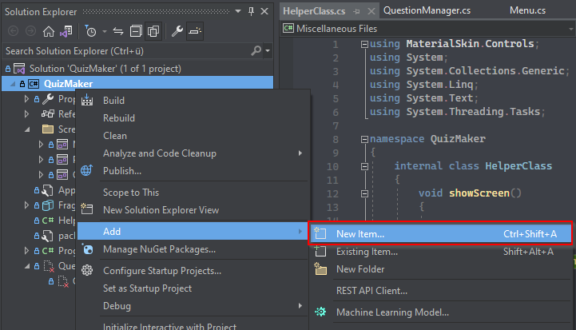
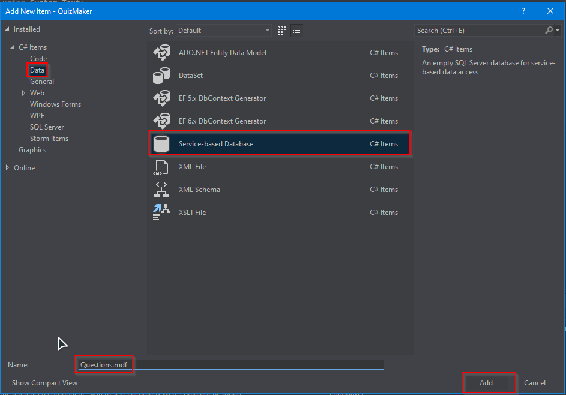
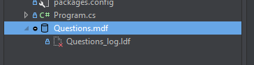
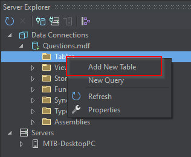
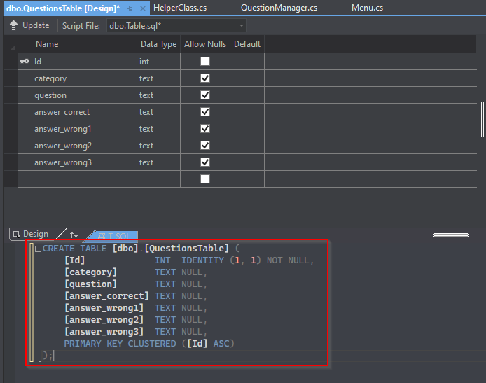
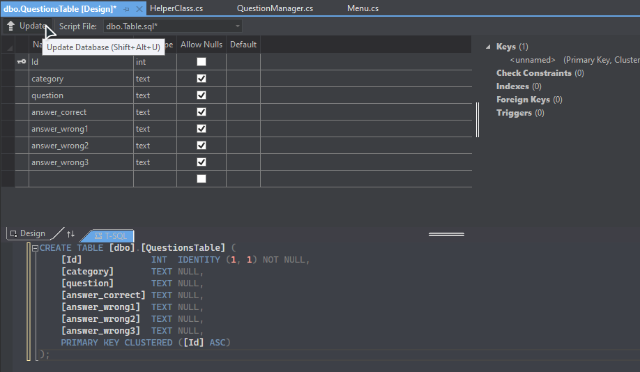

# QuizMaker

# Lokale Datenbank anlegen

Hier inst in Screenshots festgehalten wei man die lokale Datenbank anlegt, damit das Programm Daten schreiben und entfernen kann:






Doppelklick auf die Datenbank:






Folgenden Befehl in das Feld kopieren:

```
CREATE TABLE [dbo].[QuestionsTable] (
    [Id]             INT  IDENTITY (1, 1) NOT NULL,
    [category]       TEXT NULL,
    [question]       TEXT NULL,
    [answer_correct] TEXT NULL,
    [answer_wrong1]  TEXT NULL,
    [answer_wrong2]  TEXT NULL,
    [answer_wrong3]  TEXT NULL,
    PRIMARY KEY CLUSTERED ([Id] ASC)
);
```



Update

